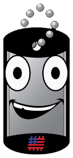

# Jody Says

A Node + Express API which was forked from JermoneSays repository, to showcase #VetsWhoCode mascot Jody.  API is hosted at [jodysays.ml](jodysays.ml)

## Usage

### GET Request:

Make request to http://jodysays.ml/::characterType::/::phrase::

**::characterType::** must be from the table below

|charaterType|Description|
|---|---|
jody|	the default #VetsWhoCode mascot Jody
drilljody |	#VetsWhoCode mascot Jody wearing his brown-round
madjody	| #VetsWhoCode mascot Jody isn't happy
eyerolljody	| #VetsWhoCode mascot Jody is a little annoyed

**::phrase::** can be any URI encoded string (most browsers convert to URI coding automatically)

Response will be a jpeg of Jody saying your string

### Post Request:
Make request to http://jodysays.ml/ with `body.text` field as a string

Response is a JSON object with text attribute giving HTML link to the above GET request. This was developed to support Slackbot development.
